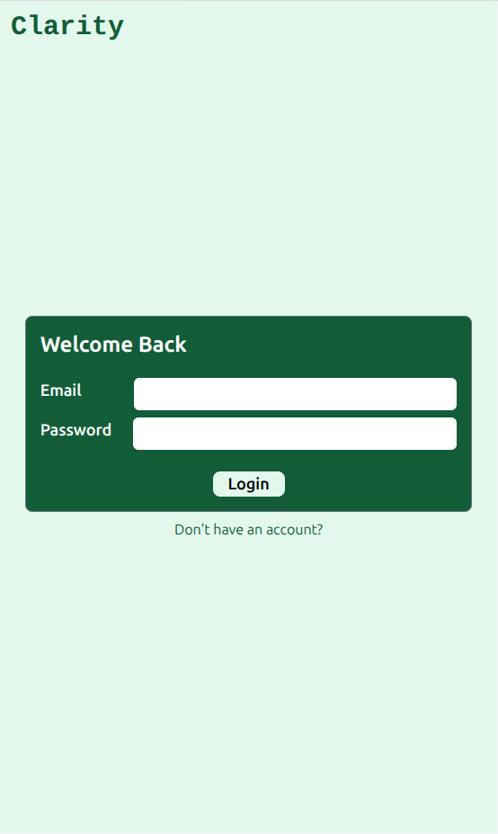
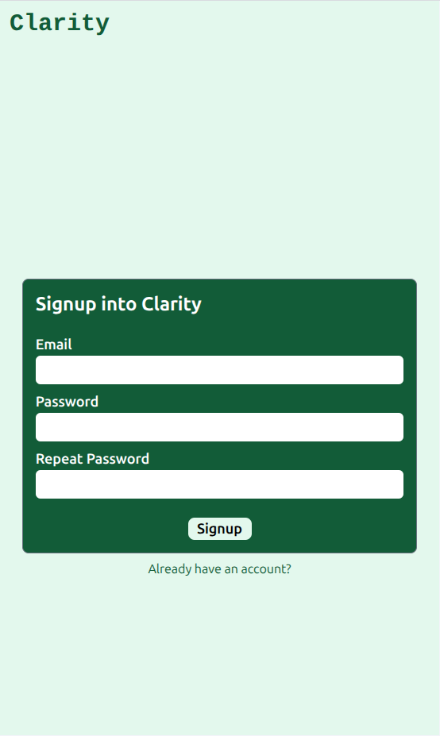
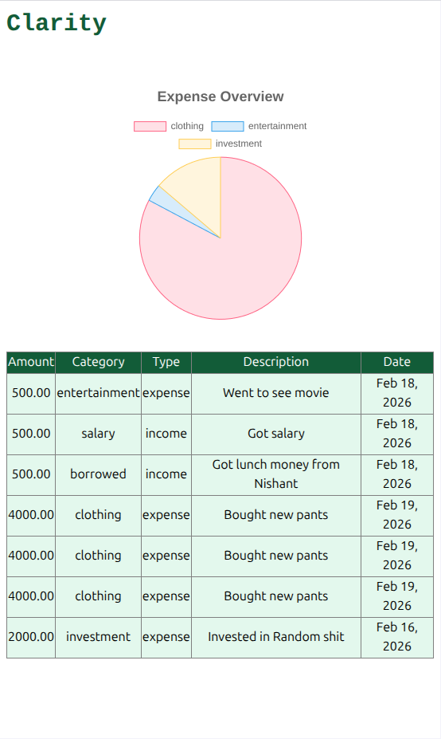
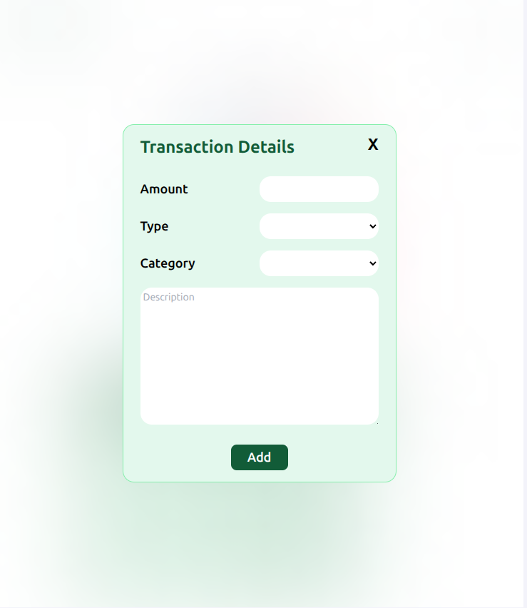

# Clarity: Expense Tracker
**Author**: `Sanskar Bhusal` <br>
**Project**: Clarity
**URL**: https://clarity.sanskarbhusal.com.np

**Pre-seeded Credentials for quick test**:<br>
Email: `test@gmail.com` <br>
Password: `password` <br>

## Installation Instruction
1. clone the repository
```bash
git clone git@github.com:sanskarbhusal/clarity.git
```
2. Install packages 

```bash
cd clarity/frontend
npm install
cd ../backend
npm install
```
3. Spin up a new terminal and cd into `clarity/backend` folder the run:
```bash
npm start
```
4. Spin up another instance of terminal and cd into `clarity/frontend` folder then run:
```bash
npm run dev
```
5. You can then access the website at: <br>
[http://localhost:5173](http://localhost:5173)

6. API will be available at: <br>
[http://localhost:3000](http://localhost:3000)


### Screenshots
#### Login Page

#### Signup Page

#### Home Page

#### Transaction Details modal


# Info
### Frontend Technologies
1. `react` + `typescript`.
2. `Vite` for compiling(ts to js) and bundling. Folder structure scafolded from Vite's `react-ts` template
4. `Tailwind` for CSS.
5. `react-router` for client side routing and page naviagation.
6. `gh-pages` CLI tool to auto-configure CI/CD in github actions.

### Backend Technologies
1. `Node.js` and `Express.js` for API
2. `Postgresql` for SQL for db.
3. Azure VM to host `node` http server and `postgresql` database server.
4. `nginx` web server configuring ssl endpoint (reverse proxy setup) with certificates managed with `certbot`.
5. Deployment environment (Ubuntu 24.04)


